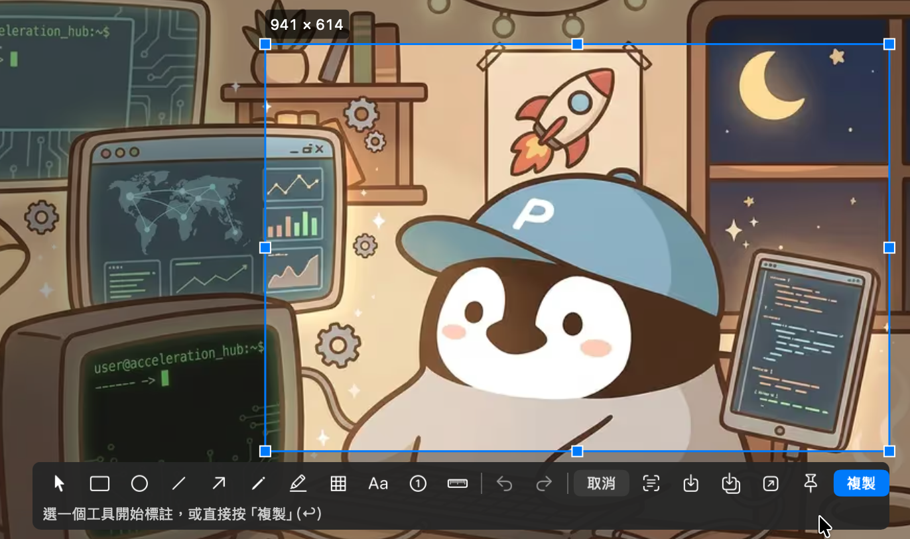
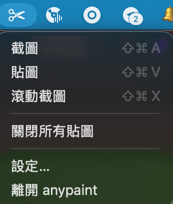
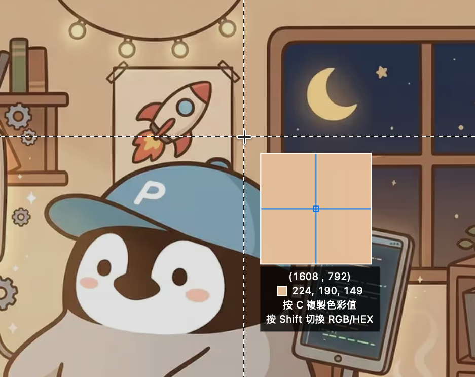
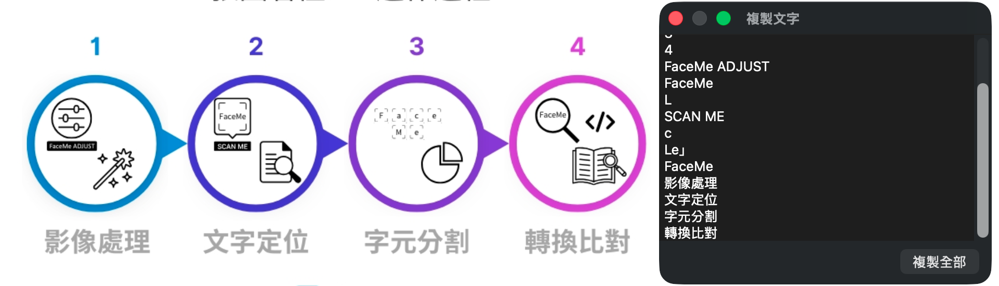
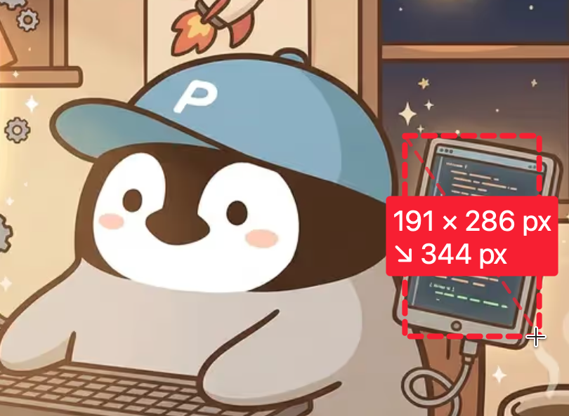
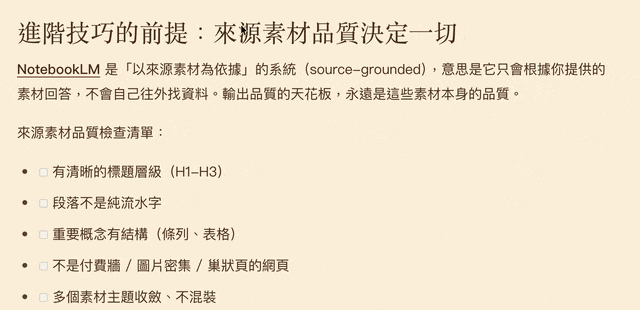
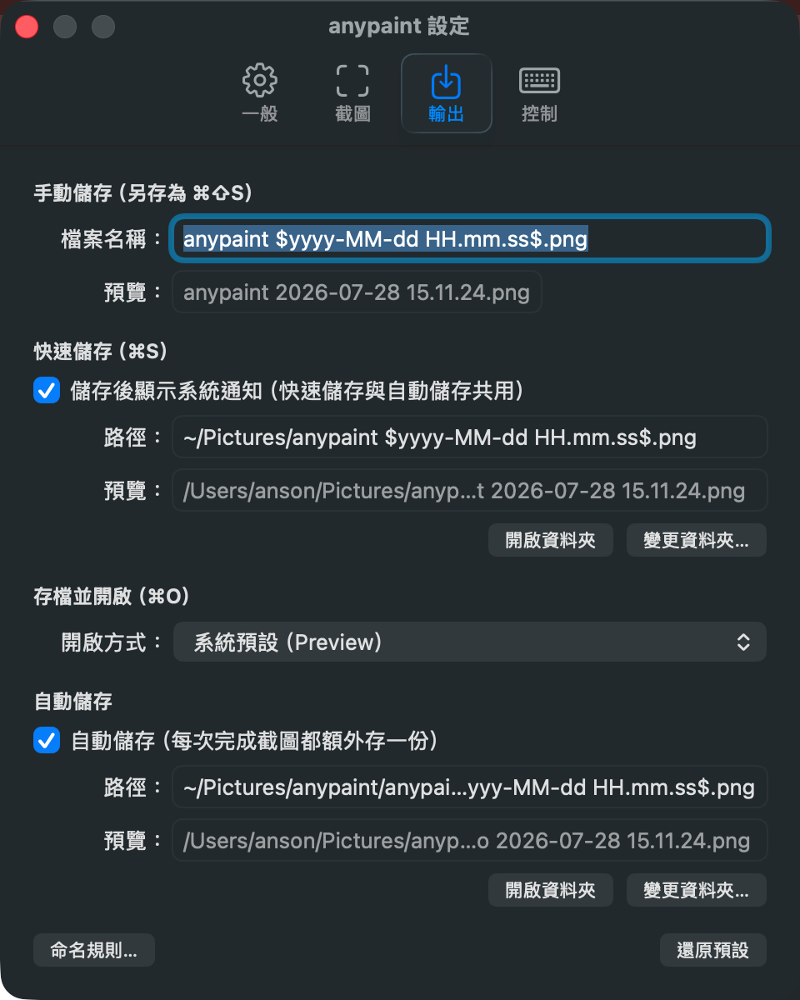

# anypaint

一個 macOS 原生的螢幕截圖 + 貼圖工具，參考 Snipaste 的核心功能。用 Swift + AppKit + ScreenCaptureKit，以 Swift Package Manager 建置（不需 Xcode）。

<p align="center">
  <br>
  <em>框選任意區域 → 縮放調整 → 用工具列標註 → 複製或存檔。</em>
</p>

## 功能
- 全域快鍵：截圖（預設 `⌘⇧A`）、貼圖（預設 `⌘⇧V`）、滾動截圖（預設 `⌘⇧X`）、動畫截圖（預設 `⌘⇧R`），可在 設定 → 控制 重新錄製。
- 框選截圖：8 控制點縮放、框內拖曳、框外重畫、即時尺寸、全螢幕十字參考線與像素放大鏡；標註（矩形／橢圓／直線／箭頭／畫筆／螢光筆／馬賽克／文字／序號／測量、色盤與粗細、undo/redo、選取與層次調整）；按 `R` 重拍（把工具畫面本身也拍進去）；多條退出與看門狗自動取消。
- 滾動截圖：手捲拼接長網頁/長文件，自動裁除固定 header/footer 與捲軸欄，完成後預覽視窗可複製/存檔/另存/存檔並開啟/丟棄。
- 動畫截圖：框選區域錄成動畫（預設 `⌘⇧R`），可設錄製秒數（欄位按 Enter 直接開始）、顯示游標與
  點擊高亮圈（設定可關）、GIF fps（8/10/12/15/20 五檔，預設 12）與 MP4 是否用 HEVC（檔案較小）；
  完成後預覽視窗可剪裁時間段（可還原）、拍快照、直接拖曳出 MP4，並從「存檔」選單匯出 GIF
  （偵測到 gifski 會自動用它產生更高品質）、全彩 APNG、MP4，或（偵測到 img2webp 才出現）WebP。
  不錄音訊，細節見 [`docs/animated-capture.md`](docs/animated-capture.md)。
- 文字／QR 辨識：框選後按 `⌘T`（或工具列的取景框鈕）直接把框內文字複製到剪貼簿；框到 QR／條碼則複製其內容。完全離線（Vision）。
- 貼圖：把剪貼簿影像變成置頂浮動視窗——拖曳、滾輪縮放、⌘+滾輪透明度、雙按關閉、中鍵重設、⇧+右鍵 OCR 複製文字；選單列「關閉所有貼圖」。
- 輸出：檔名樣板（日期 token／變數）、手動另存／快速儲存／自動儲存、儲存通知、
  「存檔並開啟」可指定要交給哪個 App（未指定＝系統預設的圖片程式）。

## 安裝（給使用者）

**系統需求：** macOS 14（Sonoma）以上。

### 步驟 0：安裝 Command Line Tools
本專案用 Swift 建置，需要 Apple 的命令列開發工具（不需完整 Xcode）。

```bash
xcode-select --install
```
會跳出系統對話框安裝（約數百 MB）。驗證：

```bash
xcode-select -p        # 應印出工具路徑
swift --version        # 需顯示 Swift 6.0 以上
```
若 Swift 版本過舊：到「系統設定 → 一般 → 軟體更新」更新系統，或安裝 Xcode 16+。

### 步驟 1：Clone 並安裝
```bash
git clone https://github.com/tzyyung/anypaint.git
cd anypaint
bash scripts/install.sh
```
安裝腳本會自建並把「anypaint.app」放進 `/Applications`（不可寫時放 `~/Applications`）。裝好後：

1. 開啟後**沒有 Dock 圖示與視窗**——看「選單列右上角」的剪刀圖示。

<p align="center">
  
</p>

2. 首次按截圖快鍵（`⌘⇧A`）時，macOS 會要求螢幕錄製權限：**系統設定 → 隱私權與安全性 → 螢幕錄製 → 允許「anypaint」**。
3. **授權後必須 `⌘Q` 完全結束再重新開啟**才會生效（僅切開關或再按快鍵不會生效）。

### 常見問題
- **授權後仍黑屏／擷取空白**：把螢幕錄製權限開關關掉再開，並 `⌘Q` 重啟。
- **開機自動啟動**：設定 → 一般 → 勾「登入時自動啟動」。
- **快鍵衝突**：設定 → 控制 → 重新錄製。
- **多螢幕**：一次截圖只會有一個選區。已經在某個螢幕框好、又到另一個螢幕拉框時，原本的
  選區會讓位；但若原本那個框**已經畫了標註**，換螢幕會被拒絕（beep）——比照同一螢幕上
  「有標註就鎖框」的規則，避免標註被無聲丟掉。要換螢幕請先按 `Esc` 重來。

## 使用
- 截圖 `⌘⇧A`：拖曳框選 → 可調整/標註 → 按「複製」（或 `Enter`）複製到剪貼簿；工具列另有
  複製文字/存檔/另存/存檔並開啟/貼上。滑鼠移到工具列任一顆鈕，底部會顯示它的用途。
  - **取色／放大鏡**：框選時有全螢幕十字參考線與像素放大鏡，即時顯示游標處色值；
    按 `C` 複製色值、`Shift` 切換 RGB／HEX。

    <p align="center">
      
    </p>
  - **複製文字 `⌘T`**：辨識框內文字並複製到剪貼簿，同時開結果窗可檢視／選取局部重新複製。
    框到 QR／條碼時複製其內容（條碼優先於文字——框住 QR 就是想拿裡面的東西）。

    <p align="center">
      
    </p>

  - **測量**（尺規鈕）：拖一下即時顯示像素讀數並烙進圖，不必切換模式——
    斜拉得 `248 × 96 px` ＋ `↗ 266 px`（對角線，畫出你實際拖的那條線）；
    拖成細長條只給那一邊的長度（量間距用）。讀數一律是像素。

    <p align="center">
      
    </p>

  - **存檔並開啟 `⌘O`**：存檔後交給外部 App 繼續編輯（長圖沒有內建標註時的替代路徑）；
    用哪個 App 在 設定 → 輸出 → 開啟方式 選。存的是正式檔，在外部 App 按 `⌘S` 直接存回原處。
  - **重拍 `R`**：把「目前這個截圖畫面」連同 anypaint 自己的十字線／工具列／放大鏡／標註
    一起重新凍結成新快照，再在上面框選——用來截「截圖工具本身」的操作畫面（做教學圖／
    文件很方便）。可連續按 `R` 疊拍。
  - 框選中的功能鍵（重拍 `R`、取色 `C`、存檔 `⌘S`、另存為 `⇧⌘S`、存檔並開啟 `⌘O`、
    辨識文字 `⌘T`）可在「設定 → 控制 → 框選中」改成自己習慣的組合，允許單鍵。
    `Esc`（取消）固定不可更改。
  - 框選開啟期間，全域快鍵一律讓路——那時鍵盤屬於框選畫面。取消框選用 `Esc`、
    工具列的「取消」鈕，或閒置一段時間後自動結束。
- 滾動截圖 `⌘⇧X`：拉框圈住會捲動的內容 → 按「開始」（或滑鼠留在框內滾一下）→ 自己往下捲
  （HUD 顯示已拼接進度；回捲會同步撤回）→ 捲到底自動結束或按「完成」→ 預覽視窗中
  複製（`⌘C`）/存檔（`⌘S`）/另存（`⇧⌘S`）/存檔並開啟（`⌘O`）/丟棄。

  <p align="center">
    
  </p>

  - **滑鼠要留在框內**；框選高度至少 320 像素（Retina 約 160 點）。
  - **慢一點捲**最穩：一次跳超過選區高度就會失去重疊，HUD 會提示回捲續接。
  - 固定頁首／頁尾與捲軸欄會自動偵測並裁除。
  - 更多眉角、診斷紀錄與運作原理：[`docs/scroll-capture.md`](docs/scroll-capture.md)。
- 貼圖 `⌘⇧V`：把剪貼簿影像貼成置頂浮動圖。滾輪縮放、`⌘`+滾輪調透明度、左鍵雙按關閉、`⇧`+雙按切換縮圖、中鍵重設、`⇧`+右鍵 OCR 取字。
- 設定分四頁：一般（開機啟動）／截圖（看門狗）／輸出（檔名樣板與儲存）／控制（快鍵改鍵＋滑鼠一覽）。

  <p align="center">
    
  </p>

- 檔名樣板語法：`$…$` 日期 token（如 `$yyyy-MM-dd HH.mm.ss$`）、`%…%` 變數；詳見設定頁「命名規則」視窗。

## 開發
```bash
bash scripts/menu.sh              # 互動選單（建置／安裝／測試／清理／簽章／移除／滾動截圖自檢）
swift build                       # 建置
swift run anypaint                # 直接跑
swift run anypaint-selftest       # 純邏輯自我測試
./scripts/build_app.sh release    # 組 .app bundle 並簽章（產出 build.noindex/anypaint.app）
```

> **滾動截圖務必用 release 建置**：影像匹配在 debug（`-Onone`）下慢約 50 倍
> （實測單格 1.3–1.7 秒 vs 30–46ms），主執行緒會被塞爆而無法正常拼接。
> `menu.sh` 的 dev app 已改用 release；`swift build` 僅用於編譯錯誤迭代。
> 選單第 8 項可執行**滾動截圖自檢**（自動開一個會動的視窗、真實擷取、驗證拼接量，不需人工互動）。

開發規範與 macOS/AppKit 踩坑紀錄見 `CLAUDE.md`（動手改滾動截圖前務必先讀）。

架構：`Sources/AnypaintKit/`（核心模組）、`Sources/anypaint/`（進入點）、`Sources/anypaint-selftest/`（測試執行檔）。KeyboardShortcuts 為本機 vendored（`vendored/KeyboardShortcuts`，patch 過資源查找）。

### 選用：持久簽章身分（給會反覆 rebuild 的開發者）
ad-hoc 簽章每次 build 識別會變，導致 TCC 螢幕錄製權限每次重置。建立持久自簽身分可讓授權跨重建保留。

**前置需求：** homebrew 的 OpenSSL 3.x（`brew install openssl`；系統內建 LibreSSL 不支援腳本所需的 `-legacy`）。

```bash
./scripts/make_signing_cert.sh    # 建一次即可，之後 build_app.sh 自動偵測使用
```
只想安裝使用的人**不需要**這步——ad-hoc 一次性安裝即可正常授權。

## 環境
macOS 14+、Swift 6.0+（開發於 macOS 26、Swift 6.3、Command Line Tools 無完整 Xcode）。
